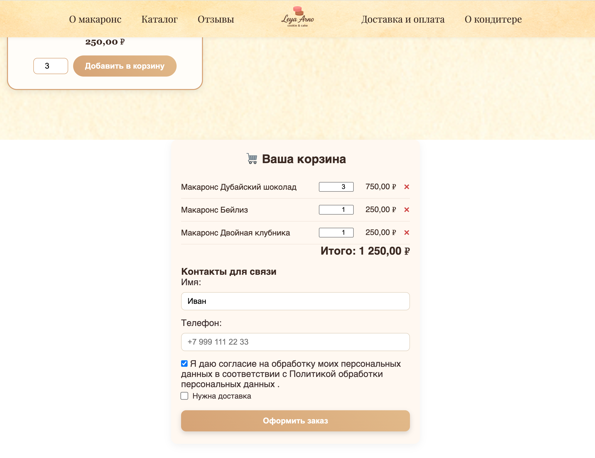
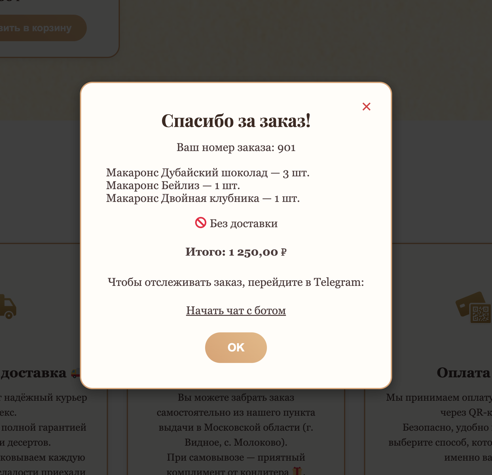
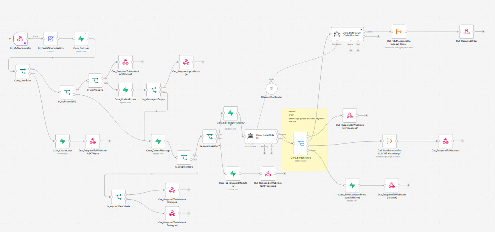
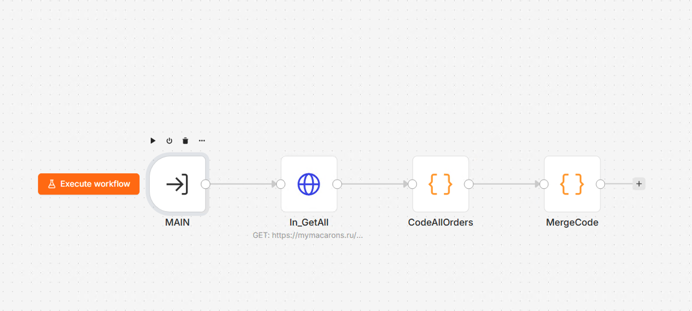
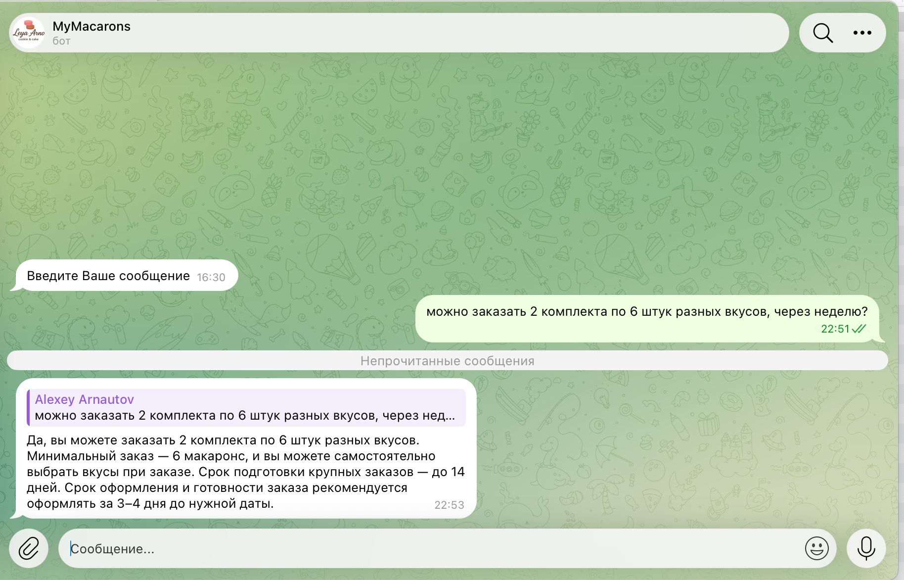
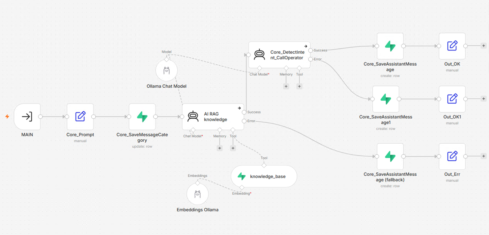
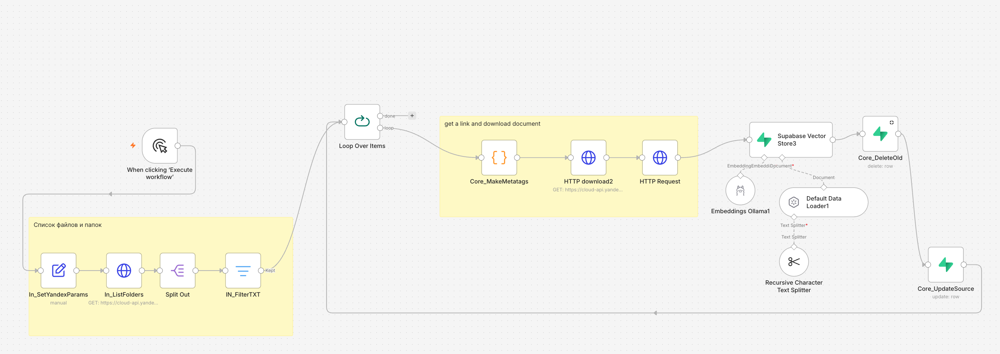
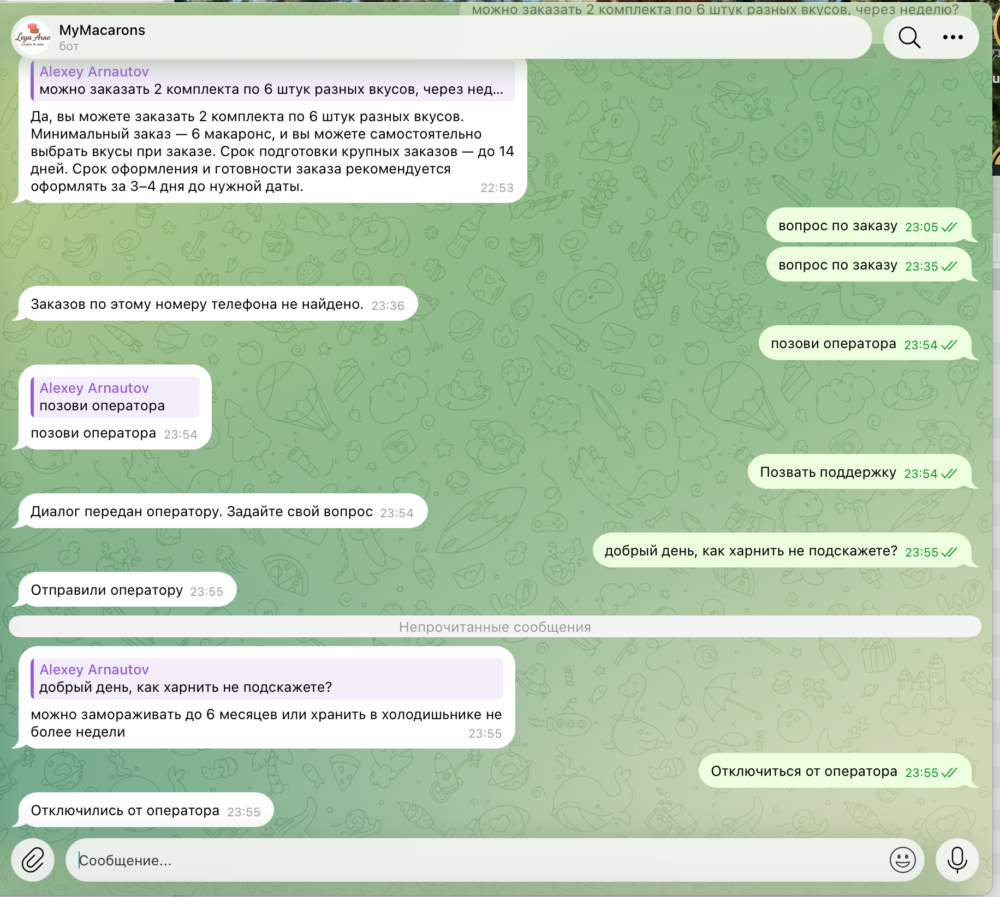

# MyMacarons — автоматизация интернет-магазина и клиентского сервиса

## Задача

Разработать и связать в единую систему интернет-магазин, обработку заказов и клиентскую поддержку.

В рамках проекта были существенно адаптированы сайт и процесс оформления заказа, реализована интеграция с WooCommerce, разработан Telegram-бот для клиентов и автоматизирована бизнес-логика через n8n.

Дополнительно реализована база знаний с RAG для автоматической обработки типовых вопросов и механизм передачи диалога оператору.

## Решение

Система объединяет несколько компонентов:

- интернет-магазин и оформление заказов;
- WooCommerce;
- Telegram-бот;
- n8n как слой интеграции и бизнес-логики;
- Supabase / PostgreSQL;
- база знаний и RAG;
- локальные AI-модели;
- операторская поддержка.

После оформления заказа клиент получает возможность продолжить взаимодействие с магазином через Telegram.

## Архитектура

```text
Интернет-магазин
       |
       v
   WooCommerce
       |
       v
      n8n
       |
       +------------------> Telegram-бот
       |                         |
       |                         +--> информация о заказах
       |                         +--> типовые вопросы
       |                         +--> оператор
       |
       +------------------> Supabase / PostgreSQL
       |                         |
       |                         +--> пользователи
       |                         +--> сообщения
       |                         +--> база знаний
       |
       +------------------> AI / RAG
                                 |
                                 +--> поиск по базе знаний
                                 +--> формирование ответа
````

## Сайт и оформление заказа

Сайт был существенно адаптирован под задачи проекта.

Автоматизированный сценарий начинается непосредственно на сайте: клиент формирует корзину, указывает контактные данные и оформляет заказ.

После оформления заказа клиенту предлагается продолжить взаимодействие через Telegram.





## Telegram-бот

Telegram-бот используется как интерфейс клиентского сервиса.

Основные функции:

* регистрация пользователя по номеру телефона;
* получение списка заказов;
* просмотр информации о заказе;
* просмотр состава заказа;
* получение ответов на типовые вопросы;
* отправка отзывов;
* обращение в поддержку;
* переключение между автоматическим режимом и оператором.

Бот работает с данными существующих заказов. Создание заказов через Telegram не используется.



## Интеграция с WooCommerce

WooCommerce является источником информации о заказах.

Через API система получает необходимые данные:

* номер заказа;
* дату;
* статус;
* информацию о доставке;
* стоимость;
* состав заказа.

n8n выполняет интеграцию между Telegram-ботом и WooCommerce и преобразует полученные данные в формат, удобный для клиента.



## AI и RAG

Для обработки типовых вопросов реализована база знаний.

Пользовательский запрос передаётся в AI/RAG workflow, где выполняется поиск релевантной информации в базе знаний.

Полученные материалы используются при формировании ответа.



Отдельные workflow отвечают за загрузку, обработку и обновление данных базы знаний.





Для AI-обработки использовалась локальная инфраструктура и модели Ollama.

## Операторская поддержка

Если вопрос не должен обрабатываться автоматически, пользователь может переключиться на оператора.

Система фиксирует режим поддержки и передаёт дальнейший диалог оператору.

После завершения обращения автоматический режим можно восстановить.

Таким образом, автоматизация разделяет типовые обращения и обращения, требующие участия сотрудника.



## n8n

n8n используется как центральный слой интеграции и оркестрации.

Основной workflow управляет маршрутизацией входящих сообщений и передаёт обработку специализированным workflow.

Отдельные workflow отвечают за:

* работу с заказами;
* базу знаний;
* AI/RAG;
* операторскую поддержку;
* обработку пользовательских данных;
* взаимодействие с WordPress/WooCommerce.

Такое разделение позволяет изменять отдельные компоненты системы без перестройки всей логики.

## Технологии

* n8n
* Telegram Bot API
* WooCommerce REST API
* WordPress
* Supabase
* PostgreSQL
* Vector Store
* RAG
* Ollama
* локальные LLM
* Python
* JavaScript
* Docker

## Результат

В рамках проекта реализована связка интернет-магазина, WooCommerce, Telegram-бота и n8n.

Автоматизированы основные сценарии клиентского взаимодействия:

* получение информации о заказах;
* обработка типовых вопросов через базу знаний;
* передача обращений оператору;
* сохранение и обработка пользовательских сообщений;
* загрузка и обновление базы знаний;
* интеграция данных между сайтом, WooCommerce, Telegram и внутренними сервисами.

Отдельно реализована AI/RAG-система на базе локальных моделей, работающая с подготовленной базой знаний.

````
