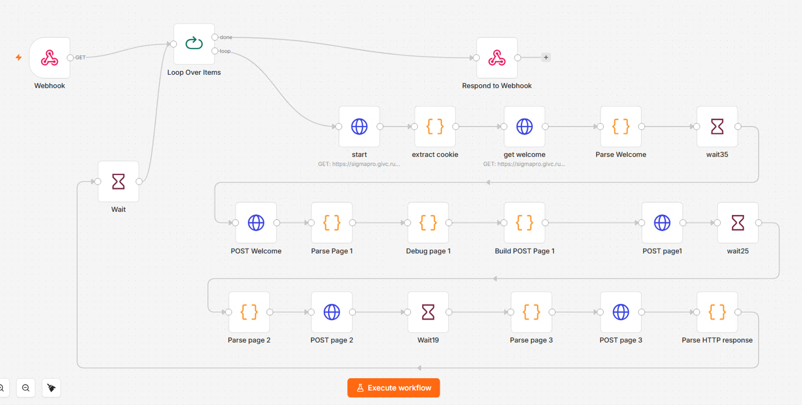

# 02 — Опрос «Помощь в опросах»

## Задача

Автоматизировать прохождение многошагового web-опроса во внешней системе без ручного участия и повысить вес организации за счет бОльшего числа ответов на однообразные вопросы.

Сценарий должен самостоятельно запускаться по расписанию, проходить последовательность страниц опроса и контролировать результат выполнения.

## Решение



На базе n8n реализован workflow, который:

- запускается по расписанию;
- устанавливает и сохраняет HTTP-сессию;
- получает необходимые параметры из HTML;
- последовательно отправляет данные на несколько этапов опроса;
- использует задержки между запросами с добавлением случайного времени;
- повторяет запуск в заданном временном интервале;
- проверяет успешность завершения.

Рабочий цикл выполняется с 08:35 до 18:00 с повторным запуском через 45 минут.

## Архитектура

```
Schedule Trigger
       |
       v
    (1) HTTP GET 
       |
       v
Парсинг сессии и HTML
       |
       v
  POST страница 1
       |
       v
     Wait
       |
       v
  POST страница 2
       |
       v
     Wait
       |
       v
  POST страница 3
       |
       v
       |
   +---+
   |       
ЦИКЛ (1)   
````

## Технологии

* n8n
* HTTP GET / POST
* JavaScript
* HTML parsing
* Cookies / HTTP Session
* Schedule Trigger
* Wait
* Conditional Logic

## Результат

Ручное прохождение многошагового web-сценария заменено автоматизированным workflow с расписанием, контролем сессии, последовательностью запросов и проверкой результата.


