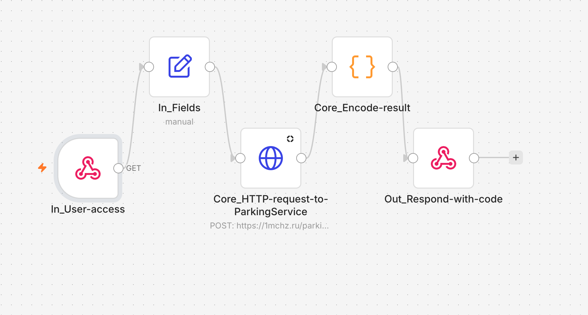

# 03 — Автоматическая выдача парковочного пропуска

## Задача

Автоматизировать оформление парковочного пропуска через внешний сервис для определенного пользователя.

Пользовательские данне "зашиты" внутри процесса. Пользователь отерывает "секретную" ссылку, которая передаёт данные автомобиля и заявки в "бюро пропусков", после чего в системе создаётся заявка и возвращается готовый результат в виде SWG QR-кода на въезд.

## Решение

Workflow реализован в n8n.

Вход выполняется через Webhook. n8n формирует заявку и отправляет её во внешний парковочный сервис через HTTP POST.

Полученный HTML-ответ обрабатывается JavaScript-кодом. Из него извлекаются номер заявки, QR-код и публичная ссылка.

Пользователю возвращается готовая HTML-страница с результатом оформления.



## Архитектура

```text
Webhook
   |
   v
In_Fields
   |
   v
HTTP Request
   |
   v
Parse Result
   |
   v
Respond
